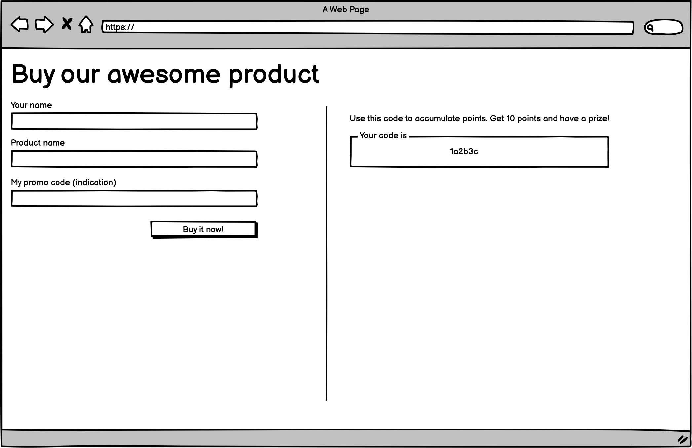

# Teste desenvolvedor backend (+frontend) da 200 Systems

Olá, obrigado por participar deste desafio para fazer parte da 200 Systems!

Por favor siga as instruções abaixo para executar o máximo dos requisitos que conseguir.

Vale ressaltar que, um código limpo e organizado, _commits_ atômicos com mensagens que explicam bem o objetivo também são importantes :)

1. Use seu próprio git para desenvolver e subir este challenge.
2. Após concluir ou chegar a data limite/prazo para entregar, envie um e-mail para o [recruta@200.systems](mailto:recruta@200.systems) com seu nome e a url do repo (mantenha como público ok?).

Caso chegue o prazo máximo e você não conseguir terminar, não tem problema. Mande a url do seu repo mesmo assim! Todo o esforço e a entrega será levado em conta.

## Contexto

Uma empresa necessita de um sistema para apoiar seu programa de indicação. Esse programa funciona assim:

- Todos que fizerem uma compra, ganha um código de indicação.
- Uma pessoa (A) compra um produto, e como todos, recebe um código de indicação.
- Outra pessoa (B) compra um produto e usa o código de indicação recebido da pessoa (A).
- A pessoa (A) acumula 1 ponto de indicação.
- Pessoas que acumularem 10 pontos de indicação, ganha um prêmio X.

## O desafio

Desafiamos você, jovem Padawan, criar uma API Rest utilizando Node, Express e MySQL. Pode utilizar Javascript ou Typescript. 

Será necessário um endpoint para registrar as compras, com ou sem código de indicação.

Exemplo input:
```
{
    "product_name": "X",
    "person_name": "B",
    "indication_code": "1a2b3c"
}
```

\* Não esqueça de retornar um novo código de indicação!


Deverá ser possível consultar todos os clientes que compraram, de modo resumido. Os maiores pontuadores são mostados primeiro.

Exemplo output:
```
{
    [
        {
            "person_code": 1,
            "person_name": "A",
            "points": 9
        },
        {
            "person_code": 2,
            "person_name": "B",
            "points": 5
        },
        {...}
    ]
}
```

E também as indicações de cada cliente.

Exemplo input:
```
{
    "person_code": 1
}
```

Exemplo output:
```
{
  "person_name": "A",
  "indications":[
    {
      "person_code": 2,
      "product_name": "X"
      "dtBuy": "2022-08-01 10:55",
      "indication_code": "1a2b3c"
    },
    {
      "person_code": 3,
      "product_name": "X"
      "dtBuy": "2022-08-01 12:13",
      "indication_code": "1a2b3c"
    },
    {
      "person_code": 4,
      "product_name": "Y"
      "dtBuy": "2022-08-02 14:27",
      "indication_code": "1a2b3c"
    },
    {...}
  ]
}
```


## Extras

Não é requerido, mas como se trata de um desafio, mostre que consegue ir mais longe. Faça uma web app com duas páginas (ou quantas achar necessário) simples utilizando <u>apenas</u> HTML, CSS e Javascript/Typescript que consuma esta API.

Uma será a página de cadastro, com um formulário e um botão comprar, que deverá fazer o input dos dados na base. 


Outra será a página de consulta, para ver os pontuadores. Ao clicar em um cliente, deve mostrar os detalhes.


